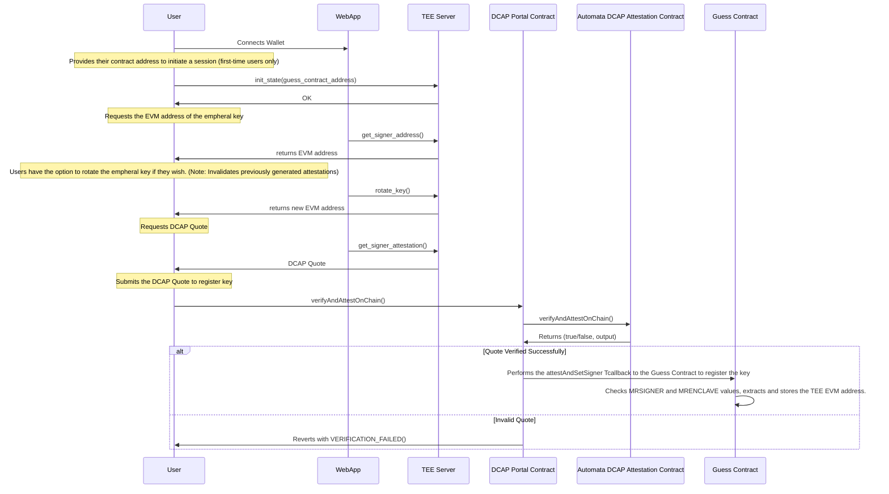
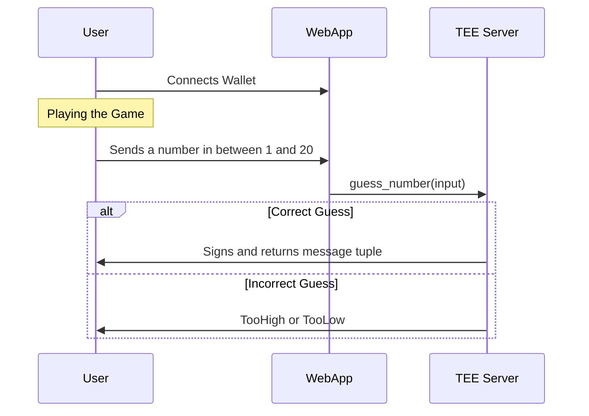
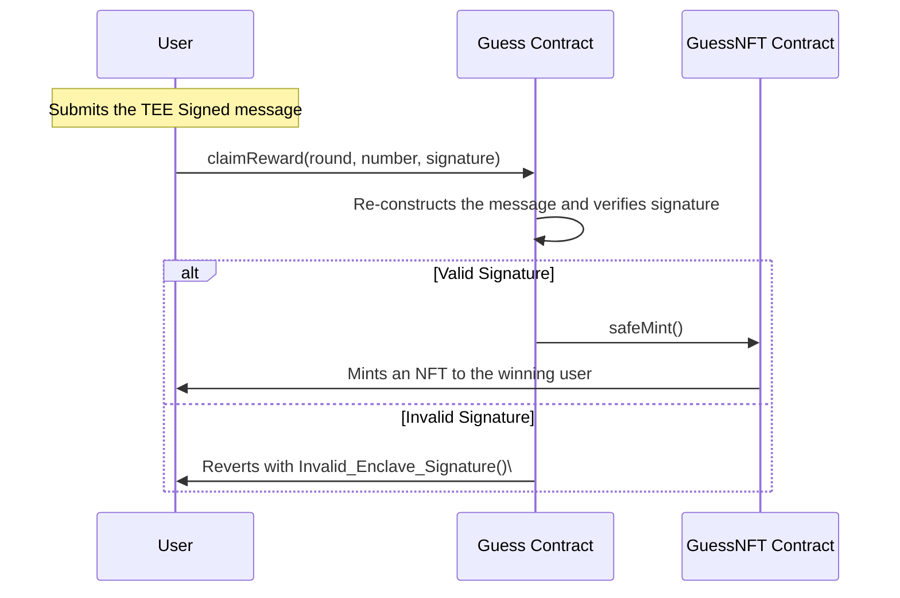

# SGX Based Number Guessing Game

By: Preston Ong

## Summary

A simple number guessing game, which players must correctly guess a random number between 1 and 20 (inclusive) generated inside a trusted executed environment (TEE), specifically with Intel SGX.

TEEs provide hardware-isolated environment to execute programs. Code and data within TEEs can not be tampered with by any untrusted applications, including the host operating system.

To ensure code integrity, a process known as **remote attestation** provides assurance to verifiers that a given instance of the program is running on genuine hardware, albeit with the assumption that all parties are fully trusting the hardware manufacturer.

The Number Guessing Game is built using [Automata SGX SDK](https://github.com/automata-network/automata-sgx-sdk). The [SGX Scaffold](https://github.com/automata-network/sgx-scaffold) repository is a great starting point to build your very own SGX applications.

## Running The Enclave

> ℹ️ **NOTE**: If you do not have physical access to an SGX machine, you may create a [DCsv3](https://learn.microsoft.com/en-us/azure/virtual-machines/sizes/general-purpose/dcsv3-series?tabs=sizebasic) instance on Microsoft Azure.
> Refer to this [docker](https://github.com/automata-network/automata-sgx-sdk/tree/main/docker) folder for the list of supported systems and workflow on setting up your VM to run the Automata SGX SDK.

Before running the enclave, you must have [Rust](https://www.rust-lang.org/tools/install) installed in your machine.

Once you have installed Rust, go ahead and install `cargo sgx`.

```bash
cargo install cargo-sgx
```

To build the enclave program, run:

```bash
cargo sgx build --release
```

Once compiled, start the server:

```bash
cargo sgx run --release
```

You may also pass the `--std` flag to `cargo sgx` to build and run the program on a non-SGX machine. This however, will not be able to generate a DCAP quote.

## Project Architecture and Workflow

### TEE Key Registration



1. Newly deployed Guess contracts must first initiate an instance in the TEE server. An instance of a Game is uniquely tied to a specified contract. In other words, a player who had won a round in Guess contract A, cannot mint NFTs via Guess contract B.

2. After a Guess contract is initiated in the TEE, the user requests then submits an attestation report (DCAP Quote) onchain to register the corresponding EVM signer address in the Guess contract.

3. At any point, users may opt to rotate keys. However, this invalidates all previously generated attestations and signatures. The winning user will **not** be able to mint NFTs using an existing signature **after** the keys had been rotated.

4. Upon successful verification of the DCAP Quote (either fully onchain or using ZK Proofs), the DCAP Portal contract performs a callback to the Guess contract, where additional validations are performed. After passing all checks, the SGX-generated EVM signer address is now registered in Guess contract.

### Guessing The Number



1. After the TEE EVM signer address has been registered in the Guess contract, the game officially begins.
2. After corretly guessing a number, a signature is generated by the TEE Server.
3. If the number were not guessed correctly, the server either returns TooLow or TooHigh.

### Signature Verification



1. The winner submits the round number, winning number and the siganture to the corresponding Guess contract.
2. The Guess contract re-constructs the message and verifies the siganture, ensuring that it is signed by the registered EVM signer address.
3. After the signature has been successfully verified, the Guess contract mints an NFT to the winner.

## Resources

Check out the repositories listed below to learn more about other helpful tools available for building TEE applications:

- [Automata On Chain PCCS](https://github.com/automata-network/automata-on-chain-pccs)
- [Automata DCAP Attestation](https://github.com/automata-network/automata-dcap-attestation)
- [Automata TDX Attestation](https://github.com/automata-network/tdx-attestation-sdk)
- [Automata DCAP SDK](https://github.com/automata-network/dcap-sdk)
- [Automata DCAP QPL](https://github.com/automata-network/automata-dcap-qpl)