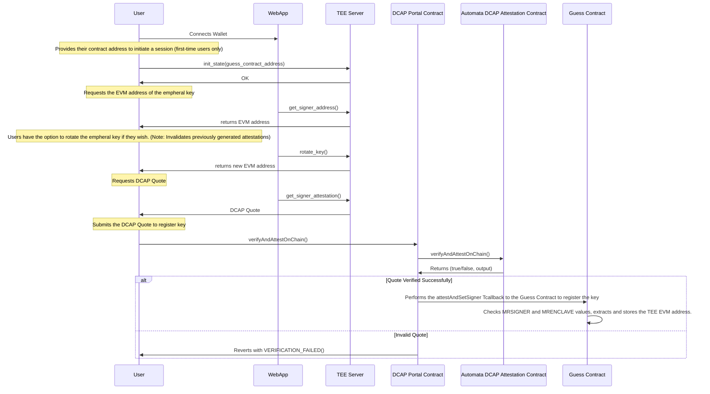
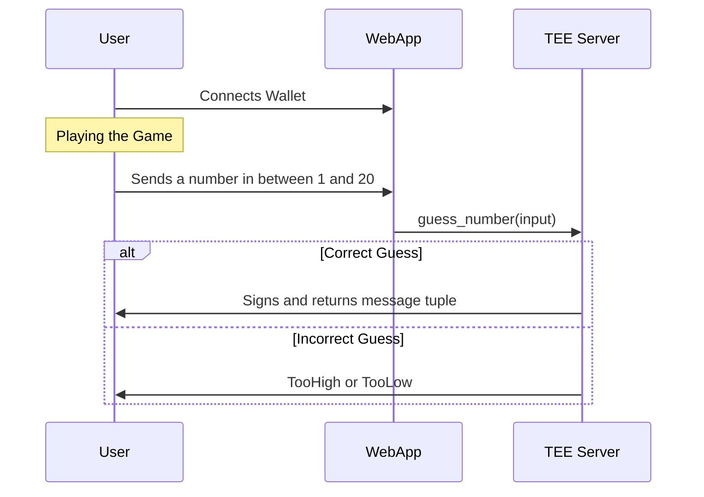
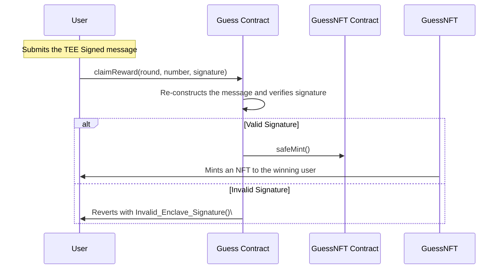

# TEE Key Registration

```mermaid
sequenceDiagram
    participant User
    participant WebApp
    participant TEE Server
    participant DCAP Portal Contract
    participant Automata DCAP Attestation Contract
    participant Guess Contract

    User->>WebApp: Connects Wallet

    note over User: Provides their contract address to initiate a session (first-time users only)
    User->>TEE Server: init_state(guess_contract_address)
    TEE Server->>User: OK

    note over User: Requests the EVM address of the empheral key
    WebApp->>TEE Server: get_signer_address()
    TEE Server->>User: returns EVM address

    note over User: Users have the option to rotate the empheral key if they wish. (Note: Invalidates previously generated attestations)
    WebApp->>TEE Server: rotate_key()
    TEE Server->>User: returns new EVM address

    note over User: Requests DCAP Quote
    WebApp->>TEE Server: get_signer_attestation()
    TEE Server->>User: DCAP Quote
    note over User: Submits the DCAP Quote to register key
    User->>DCAP Portal Contract: verifyAndAttestOnChain()
    DCAP Portal Contract->>Automata DCAP Attestation Contract: verifyAndAttestOnChain()
    Automata DCAP Attestation Contract->>DCAP Portal Contract: Returns (true/false, output)
    alt Quote Verified Successfully
        DCAP Portal Contract->>Guess Contract: Performs the attestAndSetSigner Tcallback to the Guess Contract to register the key
        Guess Contract->>Guess Contract: Checks MRSIGNER and MRENCLAVE values, extracts and stores the TEE EVM address.
    else Invalid Quote
        DCAP Portal Contract->>User: Reverts with VERIFICATION_FAILED()
    end
```

# Guessing The Number

```mermaid
sequenceDiagram
    participant User
    participant WebApp
    participant TEE Server

    User->>WebApp: Connects Wallet

    note over User: Playing the Game
    User->>WebApp: Sends a number in between 1 and 20
    WebApp->>TEE Server: guess_number(input)
    alt Correct Guess
        TEE Server->>User: Signs and returns message tuple
    else Incorrect Guess
        TEE Server->>User: TooHigh or TooLow
    end
```

# Signature Verification

```mermaid
sequenceDiagram
    participant User
    participant Guess Contract
    participant GuessNFT Contract

    note over User: Submits the TEE Signed message
    User->>Guess Contract: claimReward(round, number, signature)
    Guess Contract->>Guess Contract: Re-constructs the message and verifies signature
    alt Valid Signature
        Guess Contract->>GuessNFT Contract: safeMint()
        GuessNFT->>User: Mints an NFT to the winning user
    else Invalid Signature
        Guess Contract->>User: Reverts with Invalid_Enclave_Signature()\
    end
```